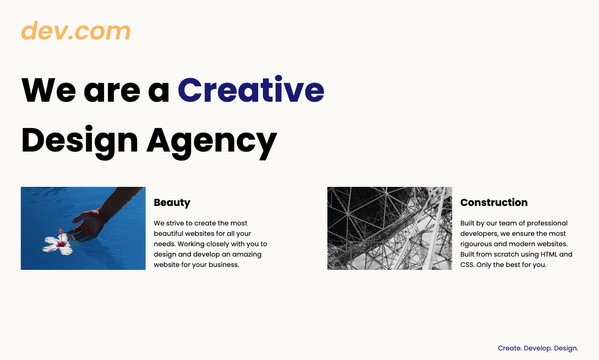

## Screenshot



### What I learned

- Some Advanced CSS concepts : Display, Float, Media Queries

### Live preview

- URL: [:smile:]()


# Getting started
For starting this in your machine, open the terminal and follow these commands:

git clone the repo
```
git clone https://github.com/Vinayy-B/frontEnd.git
```
cd into working directory
```
cd Web Design Agency Project
```

open http://localhost:3000 in browser to run.